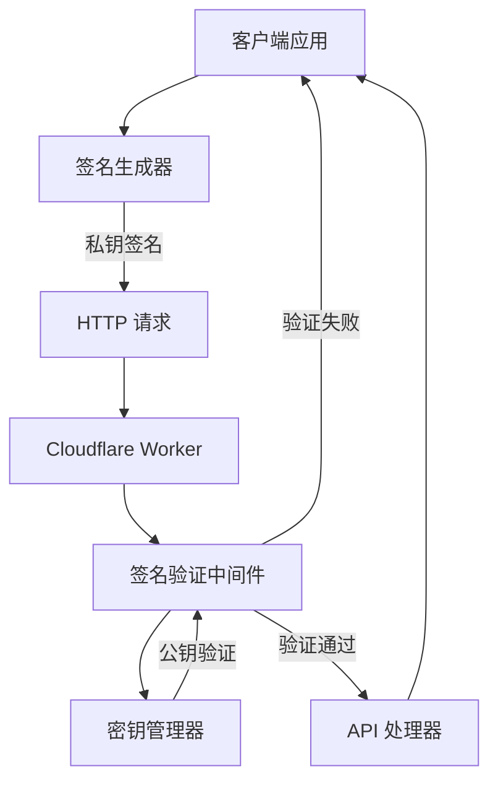

# Design Document

## Overview

本设计文档描述了如何在现有的 Hono API 框架中实现基于非对称加密的签名认证机制。该系统将采用 RSA 或 ECDSA 算法，通过私钥签名和公钥验签的方式确保 API 接口的安全访问。设计支持多渠道（App ID）管理、防重放攻击、以及与现有中间件系统的无缝集成。

## Architecture

### High-Level Architecture



### Request Flow

1. **签名生成阶段**:
   - 客户端构造请求数据（时间戳 + 方法 + 路径 + 请求体）
   - 使用私钥对请求数据进行签名
   - 将签名信息添加到 HTTP 请求头

2. **签名验证阶段**:
   - 中间件提取请求头中的签名信息
   - 根据 App ID 和 Key ID 获取对应的公钥
   - 重构签名数据并验证签名
   - 检查时间戳防止重放攻击

3. **请求处理阶段**:
   - 验证通过后继续执行后续中间件和 API 处理器
   - 验证失败则直接返回错误响应

## Components and Interfaces

### 1. 签名验证中间件 (`app/api/middleware/signature-auth.ts`)

```typescript
interface SignatureAuthConfig {
  /** 是否启用签名验证 */
  enabled: boolean;
  /** 时间窗口容差（秒） */
  timeWindow: number;
  /** 必需的请求头 */
  requiredHeaders: {
    signature: string;
    timestamp: string;
    appId: string;
    keyId?: string;
  };
  /** 支持的签名算法 */
  algorithms: ('RS256' | 'RS512' | 'ES256' | 'ES512')[];
  /** 调试模式 */
  debug: boolean;
}

interface SignatureAuthMiddleware {
  (config: SignatureAuthConfig): (c: Context, next: Next) => Promise<Response | void>;
}
```

### 2. 密钥管理器 (`app/api/auth/key-manager.ts`)

```typescript
interface KeyPair {
  /** 密钥 ID */
  keyId: string;
  /** 公钥（PEM 格式） */
  publicKey: string;
  /** 私钥（PEM 格式，仅客户端使用） */
  privateKey?: string;
  /** 签名算法 */
  algorithm: 'RS256' | 'RS512' | 'ES256' | 'ES512';
  /** 创建时间 */
  createdAt: Date;
  /** 过期时间 */
  expiresAt?: Date;
  /** 是否启用 */
  enabled: boolean;
}

interface AppConfig {
  /** 应用 ID */
  appId: string;
  /** 应用名称 */
  name: string;
  /** 关联的密钥对 */
  keyPairs: KeyPair[];
  /** 是否启用 */
  enabled: boolean;
  /** 权限配置 */
  permissions: string[];
  /** 创建时间 */
  createdAt: Date;
}

interface KeyManager {
  /** 获取应用配置 */
  getAppConfig(appId: string): Promise<AppConfig | null>;
  /** 获取公钥 */
  getPublicKey(appId: string, keyId?: string): Promise<string | null>;
  /** 验证应用是否有效 */
  validateApp(appId: string): Promise<boolean>;
  /** 添加应用配置 */
  addApp(config: AppConfig): Promise<void>;
  /** 更新应用配置 */
  updateApp(appId: string, config: Partial<AppConfig>): Promise<void>;
  /** 生成密钥对 */
  generateKeyPair(algorithm: string): Promise<KeyPair>;
}
```

### 3. 签名工具类 (`app/api/auth/signature-utils.ts`)

```typescript
interface SignatureData {
  /** 时间戳 */
  timestamp: string;
  /** HTTP 方法 */
  method: string;
  /** 请求路径 */
  path: string;
  /** 请求体（可选） */
  body?: string;
  /** 应用 ID */
  appId: string;
}

interface SignatureUtils {
  /** 生成签名数据字符串 */
  buildSignatureString(data: SignatureData): string;
  /** 使用私钥生成签名 */
  generateSignature(data: string, privateKey: string, algorithm: string): Promise<string>;
  /** 使用公钥验证签名 */
  verifySignature(data: string, signature: string, publicKey: string, algorithm: string): Promise<boolean>;
  /** 验证时间戳 */
  validateTimestamp(timestamp: string, windowSeconds: number): boolean;
}
```

### 4. 配置管理 (`app/api/auth/config.ts`)

```typescript
interface SignatureAuthEnvironment {
  /** 默认时间窗口 */
  SIGNATURE_TIME_WINDOW?: string;
  /** 签名算法 */
  SIGNATURE_ALGORITHM?: string;
  /** 调试模式 */
  SIGNATURE_DEBUG?: string;
  /** 密钥存储方式 */
  KEY_STORAGE_TYPE?: 'env' | 'kv' | 'r2';
  /** KV 命名空间（如果使用 KV 存储） */
  SIGNATURE_KV_NAMESPACE?: string;
}

interface AuthConfigManager {
  /** 从环境变量加载配置 */
  loadFromEnv(env: SignatureAuthEnvironment): SignatureAuthConfig;
  /** 验证配置 */
  validateConfig(config: SignatureAuthConfig): boolean;
  /** 获取默认配置 */
  getDefaultConfig(): SignatureAuthConfig;
}
```

## Data Models

### 请求头格式

```typescript
interface SignatureHeaders {
  /** 数字签名 */
  'X-Signature': string;
  /** 时间戳（ISO 8601 格式） */
  'X-Timestamp': string;
  /** 应用 ID */
  'X-App-Id': string;
  /** 密钥 ID（可选，默认使用应用的主密钥） */
  'X-Key-Id'?: string;
}
```

### 签名数据格式

签名数据按以下格式构造：
```
{timestamp}\n{method}\n{path}\n{appId}\n{body}
```

示例：
```
2024-01-15T10:30:00.000Z
POST
/api/users
app123
{"name":"John","email":"john@example.com"}
```

### 错误响应格式

```typescript
interface SignatureAuthError {
  success: false;
  error: {
    code: 'SIGNATURE_MISSING' | 'SIGNATURE_INVALID' | 'TIMESTAMP_EXPIRED' | 'APP_INVALID' | 'KEY_NOT_FOUND';
    message: string;
    details?: {
      appId?: string;
      keyId?: string;
      timestamp?: string;
      expectedFormat?: string;
    };
  };
  meta: {
    timestamp: string;
    requestId: string;
  };
}
```

## Error Handling

### 错误分类

1. **配置错误** (500):
   - 密钥配置缺失或格式错误
   - 算法不支持
   - 存储服务不可用

2. **认证错误** (401):
   - 签名验证失败
   - 应用 ID 无效或已禁用
   - 密钥 ID 不存在

3. **请求错误** (400):
   - 必需的请求头缺失
   - 时间戳格式错误
   - 签名格式错误

4. **时间错误** (401):
   - 时间戳过期
   - 时间戳格式无效

### 错误处理策略

1. **快速失败**: 在验证的早期阶段发现错误时立即返回
2. **详细日志**: 记录所有认证失败的详细信息用于审计
3. **安全响应**: 避免在错误消息中泄露敏感信息
4. **调试支持**: 在调试模式下提供详细的错误信息

## Security Considerations

### 1. 密钥安全

- **私钥保护**: 私钥仅在客户端使用，不应传输或存储在服务端
- **公钥存储**: 公钥可以安全地存储在服务端，支持多种存储方式
- **密钥轮换**: 支持密钥的定期轮换和版本管理
- **密钥撤销**: 支持立即禁用已泄露的密钥

### 2. 防重放攻击

- **时间戳验证**: 严格验证请求时间戳，拒绝过期请求
- **时间窗口**: 可配置的时间容差，平衡安全性和网络延迟
- **单次使用**: 可选的 nonce 机制防止相同请求的重复提交

### 3. 算法安全

- **强算法**: 仅支持安全的签名算法（RSA-SHA256/512, ECDSA-SHA256/512）
- **密钥长度**: 强制使用足够长度的密钥（RSA >= 2048 位，ECDSA >= 256 位）
- **算法协商**: 支持客户端和服务端的算法协商

### 4. 传输安全

- **HTTPS 强制**: 所有签名认证的 API 必须使用 HTTPS
- **头部保护**: 签名相关的请求头应受到传输层保护
- **内容完整性**: 签名覆盖完整的请求内容确保数据完整性

## Performance Considerations

### 1. 签名验证优化

- **公钥缓存**: 缓存解析后的公钥对象，避免重复解析
- **算法优化**: 选择性能较好的签名算法（ECDSA 通常比 RSA 更快）
- **并发处理**: 支持高并发的签名验证请求

### 2. 存储优化

- **KV 存储**: 使用 Cloudflare KV 存储密钥配置，提供全球分布式访问
- **缓存策略**: 实现多级缓存减少存储访问次数
- **批量操作**: 支持批量加载和更新密钥配置

### 3. 内存管理

- **对象池**: 复用签名验证相关的对象减少 GC 压力
- **流式处理**: 对大请求体使用流式签名验证
- **资源清理**: 及时清理不再使用的密钥和配置

## Integration with Existing System

### 1. 中间件集成

```typescript
// 在现有中间件系统中注册签名认证中间件
middlewareConfigManager.registerMiddleware(
  MiddlewareType.SIGNATURE_AUTH,
  createSignatureAuthMiddleware
);

// 添加默认配置
const signatureAuthConfig: MiddlewareConfig = {
  name: 'signatureAuth',
  type: MiddlewareType.SIGNATURE_AUTH,
  enabled: true,
  order: 5, // 在 CORS 之后，业务逻辑之前
  options: {
    enabled: true,
    timeWindow: 300, // 5 分钟
    requiredHeaders: {
      signature: 'X-Signature',
      timestamp: 'X-Timestamp',
      appId: 'X-App-Id',
      keyId: 'X-Key-Id'
    },
    algorithms: ['RS256', 'ES256'],
    debug: false
  }
};
```

### 2. 路由级别控制

```typescript
// 支持在特定路由上启用/禁用签名验证
app.use('/api/public/*', skipSignatureAuth);
app.use('/api/secure/*', requireSignatureAuth);
```

### 3. 环境配置

```typescript
// 从环境变量加载配置
const authConfig = createAuthConfig(env);
updateMiddlewareFromApiConfig(authConfig);
```

## Testing Strategy

### 1. 单元测试

- **签名工具测试**: 测试签名生成和验证的正确性
- **密钥管理测试**: 测试密钥的加载、验证和管理功能
- **中间件测试**: 测试中间件的各种场景和错误处理
- **配置测试**: 测试配置加载和验证逻辑

### 2. 集成测试

- **端到端认证**: 测试完整的签名生成到验证流程
- **多渠道测试**: 测试多个 App ID 和密钥对的场景
- **错误场景测试**: 测试各种认证失败的情况
- **性能测试**: 测试高并发下的签名验证性能

### 3. 安全测试

- **签名伪造测试**: 尝试伪造签名验证安全性
- **重放攻击测试**: 测试时间戳验证的有效性
- **密钥泄露测试**: 测试密钥泄露后的影响范围
- **算法安全测试**: 验证支持的算法的安全性

### 4. 测试工具

```typescript
// 测试辅助工具
interface SignatureTestUtils {
  /** 生成测试密钥对 */
  generateTestKeyPair(): Promise<KeyPair>;
  /** 创建测试签名 */
  createTestSignature(data: SignatureData, privateKey: string): Promise<string>;
  /** 创建测试请求 */
  createSignedRequest(path: string, body?: any, appId?: string): Promise<Request>;
  /** 验证错误响应 */
  expectAuthError(response: Response, errorCode: string): void;
}
```

## Implementation Phases

### Phase 1: 核心签名功能
- 实现签名工具类和基础算法支持
- 创建密钥管理器的基础结构
- 实现基本的签名验证中间件

### Phase 2: 多渠道支持
- 实现 App ID 管理功能
- 添加多密钥对支持
- 实现密钥的启用/禁用功能

### Phase 3: 存储和配置
- 实现多种密钥存储方式（环境变量、KV、R2）
- 添加配置管理和热重载功能
- 实现密钥的动态加载和缓存

### Phase 4: 安全增强
- 添加防重放攻击机制
- 实现密钥轮换功能
- 添加审计日志和监控

### Phase 5: 性能优化和测试
- 优化签名验证性能
- 添加全面的测试覆盖
- 性能基准测试和调优

## Deployment Considerations

### 1. 环境配置

```bash
# 基础配置
SIGNATURE_TIME_WINDOW=300
SIGNATURE_ALGORITHM=RS256
SIGNATURE_DEBUG=false

# 存储配置
KEY_STORAGE_TYPE=kv
SIGNATURE_KV_NAMESPACE=signature_keys

# 应用配置示例
APP_123_PUBLIC_KEY="-----BEGIN PUBLIC KEY-----..."
APP_123_ALGORITHM=RS256
APP_123_ENABLED=true
```

### 2. 密钥分发

- **开发环境**: 使用测试密钥对，可以硬编码在配置中
- **测试环境**: 使用独立的测试密钥，通过环境变量配置
- **生产环境**: 使用安全的密钥管理服务，定期轮换

### 3. 监控和告警

- **认证成功率**: 监控签名验证的成功率
- **错误类型分布**: 分析认证失败的原因分布
- **性能指标**: 监控签名验证的响应时间
- **安全事件**: 告警可疑的认证失败模式

### 4. 灾难恢复

- **密钥备份**: 定期备份密钥配置
- **快速恢复**: 支持从备份快速恢复密钥配置
- **降级机制**: 在认证服务不可用时的降级策略