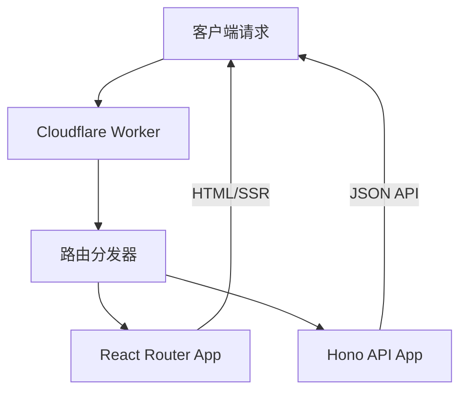

# Design Document

## Overview

本设计文档描述了如何在现有的 React Router + Cloudflare Workers 应用中集成 Hono 框架来提供 API 功能。设计采用混合架构，其中 React Router 处理前端路由，Hono 处理 API 路由，两者在同一个 Cloudflare Worker 中协同工作。

## Architecture

### High-Level Architecture



### Request Flow

1. **请求接收**: Cloudflare Worker 接收所有传入请求
2. **路由判断**: 根据请求路径判断是 API 请求还是前端页面请求
3. **分发处理**: 
   - `/api/*` 路径 → Hono 应用处理
   - 其他路径 → React Router 应用处理
4. **响应返回**: 返回相应的 JSON 数据或 HTML 页面

## Components and Interfaces

### 1. Worker Entry Point (`workers/app.ts`)

```typescript
interface WorkerHandler {
  fetch(request: Request, env: Env, ctx: ExecutionContext): Promise<Response>;
}
```

主要职责：
- 接收所有请求
- 根据路径前缀分发到不同的应用
- 处理错误和异常情况

### 2. Hono Application (`app/api/hono-app.ts`)

```typescript
interface HonoAppConfig {
  basePath: string;
  middlewares: Middleware[];
  routes: RouteHandler[];
}
```

主要职责：
- 定义 API 路由
- 配置中间件
- 处理 API 请求和响应

### 3. API Route Handlers (`app/api/routes/`)

```typescript
interface ApiRouteHandler {
  method: 'GET' | 'POST' | 'PUT' | 'DELETE';
  path: string;
  handler: (c: Context) => Promise<Response>;
  middleware?: Middleware[];
}
```

主要职责：
- 实现具体的业务逻辑
- 数据验证和转换
- 错误处理

### 4. Middleware System (`app/api/middleware/`)

```typescript
interface ApiMiddleware {
  name: string;
  handler: (c: Context, next: Next) => Promise<void>;
  config?: Record<string, any>;
}
```

包含的中间件：
- **Logger**: 请求日志记录
- **CORS**: 跨域资源共享
- **Error Handler**: 统一错误处理
- **Validation**: 请求数据验证

### 5. Type Definitions (`app/api/types/`)

```typescript
interface ApiResponse<T = any> {
  success: boolean;
  data?: T;
  error?: string;
  message?: string;
}

interface ApiError {
  code: string;
  message: string;
  details?: any;
}
```

## Data Models

### Request/Response Models

```typescript
// 通用 API 响应格式
interface StandardApiResponse<T> {
  success: boolean;
  data?: T;
  error?: {
    code: string;
    message: string;
    details?: any;
  };
  meta?: {
    timestamp: string;
    requestId: string;
  };
}

// 分页响应格式
interface PaginatedResponse<T> extends StandardApiResponse<T[]> {
  pagination?: {
    page: number;
    limit: number;
    total: number;
    totalPages: number;
  };
}
```

### Configuration Models

```typescript
interface HonoConfig {
  basePath: string;
  cors: {
    origin: string | string[];
    methods: string[];
    headers: string[];
  };
  logging: {
    enabled: boolean;
    level: 'debug' | 'info' | 'warn' | 'error';
  };
}
```

## Error Handling

### Error Classification

1. **Validation Errors** (400): 请求数据格式错误
2. **Authentication Errors** (401): 认证失败
3. **Authorization Errors** (403): 权限不足
4. **Not Found Errors** (404): 资源不存在
5. **Server Errors** (500): 内部服务器错误

### Error Response Format

```typescript
interface ErrorResponse {
  success: false;
  error: {
    code: string;
    message: string;
    details?: any;
  };
  meta: {
    timestamp: string;
    requestId: string;
  };
}
```

### Error Handling Strategy

1. **全局错误处理器**: 捕获所有未处理的异常
2. **类型化错误**: 使用自定义错误类进行分类
3. **错误日志**: 记录错误详情用于调试
4. **用户友好消息**: 返回适合用户的错误信息

## Testing Strategy

### Unit Testing

- **API 路由测试**: 测试每个 API 端点的功能
- **中间件测试**: 验证中间件的行为
- **工具函数测试**: 测试辅助函数和工具类

### Integration Testing

- **端到端 API 测试**: 测试完整的请求-响应流程
- **Worker 集成测试**: 验证 React Router 和 Hono 的协同工作
- **错误场景测试**: 测试各种错误情况的处理

### Testing Tools

- **Vitest**: 单元测试框架
- **Supertest**: API 测试工具
- **MSW**: Mock Service Worker 用于模拟外部服务

### Test Structure

```
tests/
├── unit/
│   ├── api/
│   │   ├── routes/
│   │   └── middleware/
│   └── utils/
├── integration/
│   ├── api/
│   └── worker/
└── fixtures/
    ├── requests/
    └── responses/
```

## Implementation Phases

### Phase 1: Core Infrastructure
- 设置 Hono 依赖和基础配置
- 修改 Worker 入口点以支持路由分发
- 创建基础的 Hono 应用结构

### Phase 2: Middleware System
- 实现核心中间件（CORS、Logger、Error Handler）
- 设置中间件配置系统
- 添加请求验证中间件

### Phase 3: API Routes
- 创建示例 API 路由
- 实现 RESTful 端点
- 添加类型安全的请求/响应处理

### Phase 4: Integration & Testing
- 确保与现有 React Router 应用的兼容性
- 添加全面的测试覆盖
- 性能优化和错误处理完善

## Security Considerations

1. **输入验证**: 所有 API 输入都必须经过验证
2. **CORS 配置**: 正确配置跨域访问策略
3. **错误信息**: 避免泄露敏感的系统信息
4. **请求限制**: 实现适当的请求频率限制
5. **环境变量**: 敏感配置使用环境变量或 Secrets

## Performance Considerations

1. **冷启动优化**: 最小化 Worker 启动时间
2. **内存使用**: 优化内存占用，避免内存泄漏
3. **响应时间**: 确保 API 响应时间在可接受范围内
4. **缓存策略**: 适当使用缓存减少重复计算
5. **Bundle 大小**: 控制最终 Worker 包的大小